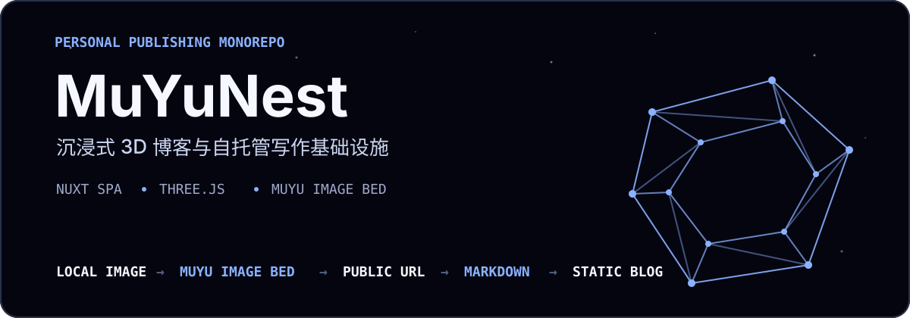
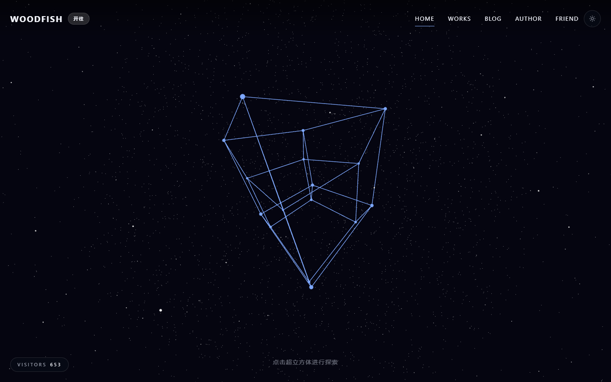

<p align="center">
  
</p>

<p align="center">
  <a href="https://blog.woodfish.site/">在线博客</a>
  ·
  <a href="https://img.woodfish.site/api/health">图床状态</a>
  ·
  <a href="./docs/muyu-architecture.md">系统架构</a>
  ·
  <a href="./deploy/image-bed/README.md">部署手册</a>
</p>

MuYuNest（代码中的项目名为 `WoodFishNest`）把个人博客、内容构建工具和自托管图床放进一个 pnpm monorepo。它既负责呈现一个可交互的 Three.js 博客，也负责把本地图片变成可长期引用的公开 URL，让 Markdown 在构建和运行时都不依赖图床 API。

## 先看成果

<p align="center">
  <a href="https://blog.woodfish.site/">
    
  </a>
</p>

线上首页会随主题在**超立方体**与**莫比乌斯带**之间切换，并提供 Blog、Works、Author、Friend 等内容入口。上图来自当前部署的真实页面。

## 一个仓库，两条主线

### 沉浸式博客

- Nuxt SPA 承载文章、作品、作者与友链内容。
- Three.js 绘制可交互的昼夜几何场景，GSAP 负责界面与场景过渡。
- `content-tools` 在构建前把 Markdown、图片与元数据整理为静态内容。
- 最终产物可作为静态站点部署，线上地址为 [blog.woodfish.site](https://blog.woodfish.site/)。

### 自托管写作基础设施

- `muyu-upload` 接收 Typora 或命令行传入的本地图片。
- Hono API 负责鉴权、上传和管理，SQLite 保存元数据与审计记录。
- Sharp 生成 original、WebP 与缩略图版本，Nginx 直接提供公开文件。
- Markdown 只保存公开图片 URL；博客运行时无需调用图床 API。

```text
Typora / local image
        │
        ▼
   muyu-upload ─────► Muyu image-bed ─────► public image URL
                                                │
Markdown source ─────► content-tools ───────────┤
                                                ▼
                                      static Nuxt blog
```

## 工作区

| 路径 | 职责 | 主要技术 |
| --- | --- | --- |
| `apps/blog` | 博客 SPA 与 Three.js 交互场景 | Nuxt, Vue, Three.js, GSAP |
| `apps/image-bed-api` | 图片上传、权限与管理 API | Hono, SQLite, Sharp |
| `apps/image-bed-web` | 图床管理后台 | Vue, Vite |
| `packages/content-tools` | Markdown 内容生成与图片优化 | TypeScript, markdown-it, Sharp |
| `packages/upload-cli` | Typora / CLI 图片上传器 | TypeScript |
| `packages/shared` | API 合约与 URL 工具 | TypeScript |
| `deploy` | Nginx、Docker、systemd 与备份脚本 | Shell, PowerShell |

## 快速开始

需要 **Node.js 22** 与 **pnpm 10.11.0**。从仓库根目录启动博客：

```bash
pnpm install
pnpm dev
```

终端输出本地地址后即可打开博客。修改源 Markdown 或准备生产构建时，先刷新静态内容：

```bash
pnpm generate:content
pnpm build
```

## 图床开发

图床 API 需要 `PUBLIC_BASE_URL`、存储路径、SQLite 路径和 `TOKEN_SECRET` 等环境变量，完整示例见 [`deploy/image-bed/image-bed-api.env.example`](./deploy/image-bed/image-bed-api.env.example)。

```bash
# API
pnpm image-bed:api:dev

# 管理后台（另开终端）
pnpm image-bed:web:dev
```

Typora 接入、令牌配置与诊断命令见 [`docs/muyu-typora-upload.md`](./docs/muyu-typora-upload.md)。

## 常用命令

| 命令 | 用途 |
| --- | --- |
| `pnpm typecheck` | 检查博客类型 |
| `pnpm test` | 运行博客测试 |
| `pnpm build:deploy` | 生成部署版本并校验静态产物 |
| `pnpm image-bed:api:test` | 测试图床 API |
| `pnpm image-bed:web:build` | 构建图床管理后台 |
| `pnpm upload-cli:test` | 测试上传 CLI |
| `pnpm content-tools:test` | 测试内容工具 |
| `pnpm security:audit` | 检查高危依赖问题 |

## 部署与运维

博客保持静态 SPA 部署；图床采用“宿主机 Nginx + Docker API + 宿主机持久化目录”的拓扑：

```text
Nginx
├── /o/*      → /srv/muyu-images
├── /admin/*  → static admin UI
└── /api/*    → 127.0.0.1:3000 → Hono container

/srv/muyu-data/muyu.sqlite
```

- [图床部署、TLS、备份与恢复](./deploy/image-bed/README.md)
- [公共域名、兼容重定向与 TLS](./docs/domain-routing.md)
- [Muyu 架构与权限边界](./docs/muyu-architecture.md)
- [从 Typora 到静态博客的写作流程](./docs/muyu-writing-workflow.md)
- [日常运维手册](./docs/muyu-ops-runbook.md)

## 技术栈

`Nuxt 5 nightly` · `Vue 3` · `Three.js` · `GSAP` · `Tailwind CSS 4` · `Hono` · `SQLite` · `Sharp` · `Vitest` · `Playwright` · `pnpm workspaces`
