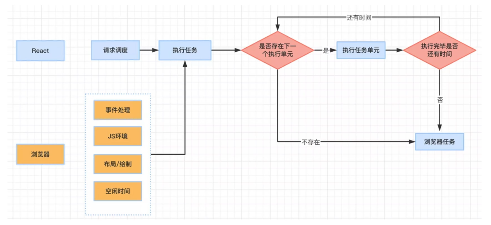

## 一、先定位多余渲染从哪里来
父组件更新时，React 默认会继续渲染它的子组件。子组件即使没有用到这次变化的数据，也可能重新执行渲染逻辑。组件树一大，这类重复工作就会逐渐显出成本。

---
## 二、源码层优化
### 1. 时间切片（Time Slicing）
- 可以把它理解为：把可调度的渲染工作拆开执行，并在需要时把主线程交还给浏览器。笔记里用 **单帧执行不超过 16ms** 描述一帧的时间预算；当工作逼近或超过16ms时，需要留意主线程是否被长任务占住。这个数值便于理解，但不是 React 对每次任务的硬性承诺。
- 这样做是为了减少长任务持续占用主线程，而不是让所有渲染都变得更快。
- 

### 2. Fiber 架构
1. 每个组件对应一类 **Fiber 任务单元**。
2. Fiber 节点通过 `child / sibling / return` 指针连接，React 可以据此记录工作进度，为中断和恢复渲染提供基础。

下面的公式是对执行过程的简化记忆：
$$
\text{Fiber 任务} \xrightarrow{\text{16ms 切片}} \text{浏览器渲染} \xrightarrow{\text{恢复}} \text{下一个 Fiber 任务}
$$

---
## 三、代码层优化
### 1. 避免 state 相同值触发更新
- 类组件可以继承 `PureComponent`，让 React 对 props 和 state 做浅比较。
- 函数组件更新 state 时会判断新旧值是否相同，但对象和数组仍要留意引用是否变化。

### 2. 阻止 props 引发的无效更新
#### （1）基础方案
- 类组件使用 `PureComponent` 做浅比较。
- 函数组件可以交给 `React.memo` 包装，同样从 props 的浅比较入手。

#### （2）引用类型陷阱
如果父组件每次渲染都重新创建函数、对象或数组，即使内容没变，引用也已经变了。此时 `memo` 的浅比较仍会判定 props 发生变化。

#### （3）Hook 缓存方案
函数引用需要保持稳定时，可以使用 `useCallback`：
```js
const fn = useCallback(() => {}, [])
```
对象、数组或计算结果需要缓存时，可以使用 `useMemo`：
```js
const obj = useMemo(() => ({ a: 1 }), [])
```
这里的依赖项都是空数组，因此只在首次渲染时创建。真实业务里如果函数或计算依赖外部值，要把对应依赖补全，否则会读到旧值。

---
## 四、怎么判断该不该优化
1. 先确认父组件更新时，子组件是否真的产生了可观测的重复渲染。
2. 组件边界明确后，再用 `memo / PureComponent` 跳过一部分重复工作。
3. 传递引用类型 props 时，检查引用变化是不是让浅比较失效。
4. 确实需要稳定引用时，再使用 `useCallback / useMemo`，不要先给所有函数和对象套缓存。

不要把下面的式子当成通用性能公式，它更适合作为本节几个工具的索引：
$$
\text{有效渲染} = \text{memo} + \text{useCallback} + \text{useMemo}
$$
