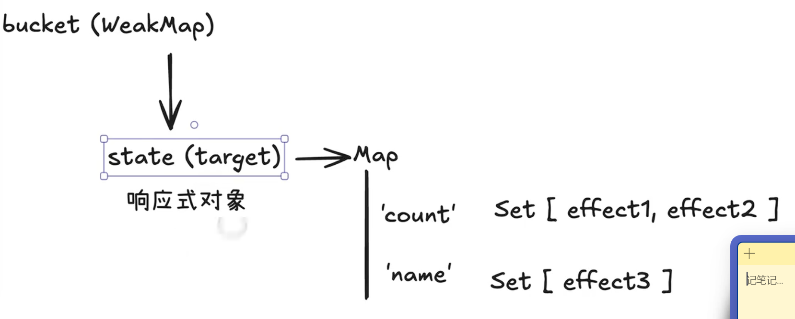
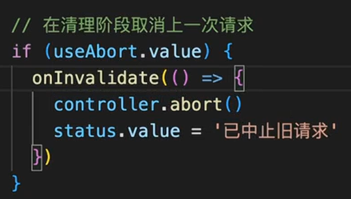
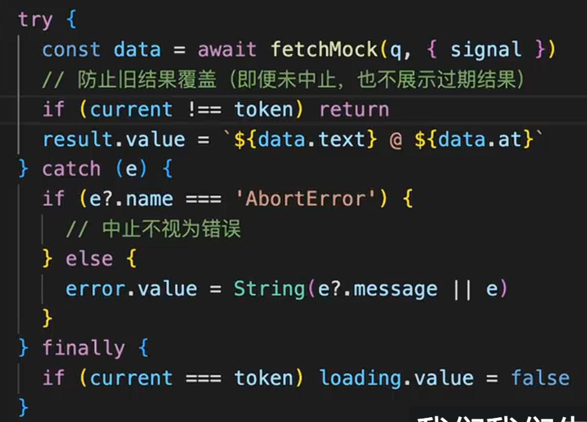

组件逻辑拆散后很难复用，副作用没有清理会继续修改已离开的页面，`provide / inject` 和插槽又处理不同方向的数据传递。把这些现象放回响应式、组件边界和渲染时机中，才能判断 `nextTick`、路由守卫或自定义指令该用在什么位置。

## 一、为什么 Vue 3 更强调 Composition API

Options API 容易把同一块业务逻辑拆散到 `data`、`methods`、`computed`、`watch` 不同区域。Composition API 可以把同一功能放在一起，后续再封装成组合函数。

这背后有两个实际收益：

- 逻辑聚合，维护成本更低
- 复杂业务更容易抽成 `useXxx` 组合函数

## 二、`ref`、`reactive`、`computed`、`watch` 怎么选

### 1. `ref`

基础类型通常先考虑下面两点：

- 更常用于基础类型
- 在 `script` 中需要通过 `.value` 访问

```js
const count = ref(0);
count.value++;
```

### 2. `reactive`

- 更适合对象、数组这类复杂结构
- 属性访问更自然
- 会做深层响应式代理

```js
const state = reactive({
  user: { name: "woodfish" },
});
```

### 3. `computed`

- 用于基于已有响应式数据派生新值
- 默认带缓存
- 常见场景是表单展示状态、列表过滤结果、格式化视图数据

### 4. `watch`

- 用来“侦听变化后执行副作用”
- 适合请求、日志、持久化、联动逻辑

```js
watch(
  count,
  (newVal, oldVal) => {
    console.log(`changed from ${oldVal} to ${newVal}`);
  },
  {
    immediate: true,
    deep: true,
  }
);
```

## 三、Vue 3 响应式到底是怎么工作的

响应式依赖关系可以用 `bucket`、`effect`、`track`、`trigger` 四个概念拆开。

### 1. 流程

可以把 Vue 3 响应式理解成四步：

1. 用 `Proxy` 拦截对象读写
2. 读取时收集依赖
3. 修改时触发依赖
4. 让副作用函数重新执行

### 2. `effect`

`effect` 的职责是注册副作用函数。所谓副作用，简单理解就是“依赖响应式数据、并且在数据变化后需要重新执行的逻辑”。

### 3. `track`

在 `get` 捕获器中，Vue 会记录：

- 当前访问了哪个对象
- 访问了哪个属性
- 当前活跃的副作用函数是谁

### 4. `trigger`

在 `set` 捕获器中，Vue 会找到之前收集过的依赖，并重新调度这些副作用函数。

下面这张图适合用来理解依赖收集结构：



## 四、Vue 响应式的常见陷阱

问题通常出在引用关系变化后，代码仍按原来的响应式对象来理解。

### 1. 响应式对象解构后失去响应性

先看解构响应式对象的结果：

```js
const bob = reactive({ name: "Bob" });
const { name } = bob;
```

这里的 `name` 不再是响应式引用，它只是一个普通值的拷贝结果。

如果确实需要解构，应该使用：

```js
const state = reactive({ count: 0 });
const count = toRef(state, "count");
```

或者：

```js
const refs = toRefs(state);
```

### 2. `ref` 包对象时，直接改引用要小心

如果你把对象放进 `ref` 里，再把 `form.value` 赋给另一个变量并修改内部属性，本质上操作的还是同一个对象引用。

因此，删除字段或修改内部属性时，原对象也会观察到同一次变更。

### 3. `Map` / `Set` 场景优先考虑 `reactive`

`ref` 并不适合覆盖所有数据结构。当数据是 `Map`、`Set`、`WeakMap`、`WeakSet` 时，更适合直接使用 `reactive`。

## 五、生命周期划分组件执行阶段

生命周期的本质，是把组件从“创建、挂载、更新、卸载”的关键阶段切出来，让你在合适时间做合适的事。

常见钩子对应不同的执行时机：

- `onMounted`：DOM 已挂载，适合发请求、初始化第三方库
- `onUpdated`：视图更新后执行
- `onUnmounted`：做销毁清理

组件在不同阶段能执行的操作不同，生命周期让请求、DOM 初始化和资源清理各自有明确位置。

## 六、副作用清理为什么重要

痛点通常是这些：

- 定时器没有清掉
- 订阅没有关闭
- 请求没有取消
- 页面切走后旧逻辑还在跑

### 1. 清理何时发生

在 Vue 中，副作用清理通常发生在两个时机：

1. 副作用函数下一次重新执行前
2. 组件卸载时

### 2. `watchEffect` + `onInvalidate`

```js
watchEffect((onInvalidate) => {
  const id = setInterval(() => {
    ticks.value += 1;
  }, intervalMs.value);

  onInvalidate(() => {
    clearInterval(id);
  });
});
```

核心思想非常值得背下来：

“创建副作用的逻辑，应该和清理副作用的逻辑放在一起。”

下面两张配图可以一起看：





## 七、组件通信怎么系统地理解

### 1. `provide / inject`

当数据需要跨层级传递时，`provide / inject` 是比层层 `props` 更轻的方案。

```vue
<script setup>
import { provide, ref } from "vue";

const msg = ref("我是祖先的数据");
const updateMsg = () => {
  msg.value = "数据已更新";
};

provide("appData", { msg, updateMsg });
</script>
```

子组件接收：

```vue
<script setup>
import { inject } from "vue";

const { msg, updateMsg } = inject("appData");
</script>
```

如果只是简单跨层传递，它很好用；但如果已经是全局共享状态，往往还是推荐更清晰的状态管理方案。

### 2. 插槽

插槽可以理解成“父组件向子组件预留内容口子”。

常见三类：

- 默认插槽
- 具名插槽
- 作用域插槽

作用域插槽最关键的点是：

“子组件把数据提供给插槽内容使用。”

这也是很多列表组件、表格组件高度灵活的基础。

## 八、Vue Router 的接入与守卫

### 1. 基础接入

通常是：

1. 创建路由配置
2. 在 `main.js` 挂载路由
3. 在 `App.vue` 放 `router-view`

### 2. 路由跳转

- 声明式：`<router-link>`
- 编程式：`router.push()`

### 3. 动态路由

通过 `/user/:id` 这类方式传递参数。

### 4. 路由守卫

路由守卫常用于登录校验、权限判断、页面埋点和离开确认。

## 九、自定义指令什么时候用

自定义指令适合封装直接操作 DOM 的通用逻辑。

常见场景有：

- 自动聚焦
- 点击防抖
- 权限控制
- DOM 样式或行为增强

### 1. 局部指令

```vue
<script setup>
const vFocus = {
  mounted(el) {
    el.focus();
  },
};
</script>
```

### 2. 全局指令

在 `main.js` 中通过 `app.directive()` 注册。

### 3. 指令生命周期

理解点在于：指令是围绕“绑定元素”工作的，不是围绕“组件实例”工作的。

## 十、模板编译、diff 和 `nextTick` 的更新链路

### 1. 模板编译

模板编译可以拆成三段：

1. Parse：模板转 AST
2. Transform / Optimize：做静态分析和优化
3. Codegen：生成渲染函数

经过这三步，模板会变成可执行的渲染函数。

### 2. diff

Vue 2 和 Vue 3 的 diff 重点不同：

- Vue 2：双端比较
- Vue 3：编译期优化 + 运行时更高效的更新策略

这里要区分两件事：

1. diff 不是全量暴力比较，而是基于同层节点、相同类型节点进行高效更新
2. Vue 3 的优势不只是运行时 diff，更重要的是编译期已经减少了很多不必要工作

### 3. `nextTick`

`nextTick` 的本质不是“延迟一会儿”，而是：

“等本轮 DOM 更新完成后，再执行回调。”

典型场景：

- 更新数据后立即拿最新 DOM
- 列表渲染后做滚动定位
- 打开弹窗后聚焦输入框

## 十一、实现时容易混淆的边界

### 1. 响应式包含四个环节

`Proxy`、依赖收集、触发更新、副作用函数。

### 2. `watch` 和 `watchEffect` 的依赖来源不同

- `watch` 更明确地指定监听源
- `watchEffect` 会自动收集内部使用到的响应式依赖

### 3. 副作用清理不只处理内存

它还要避免旧请求、旧定时器和旧订阅继续影响当前页面状态。

### 4. diff 之前还有编译阶段

模板先编译成渲染函数，再由响应式系统触发更新。diff 只负责运行时需要比较的部分。

### 从状态变更追到 DOM 更新

状态变化先触发依赖，再生成新的渲染结果，diff 计算最小更新，DOM 刷新完成后才轮到 `nextTick` 回调。需要读取最新 DOM 时，要沿这条链路判断时机。
