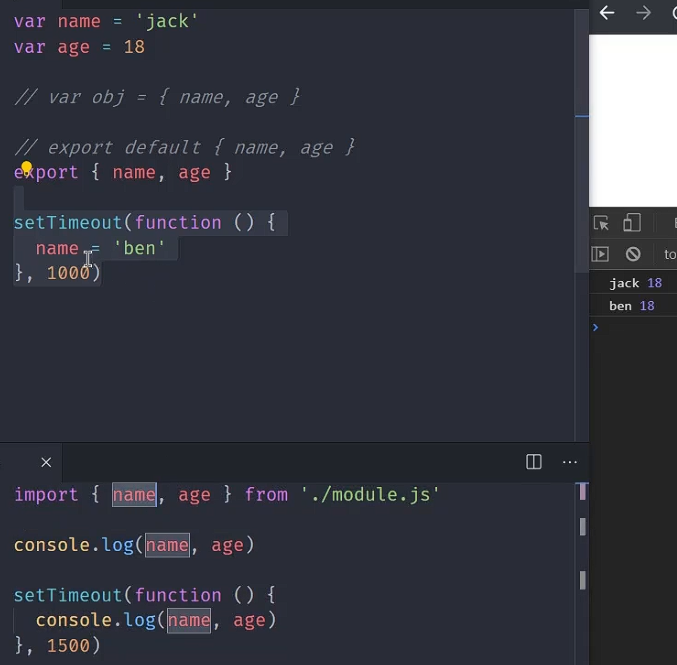
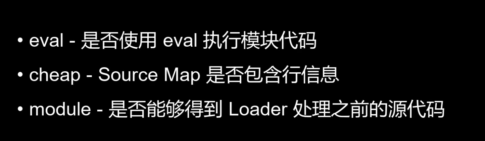
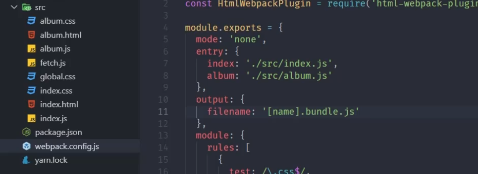
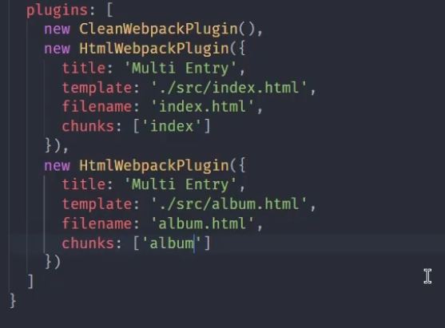

项目拆成多个 JavaScript 文件后，先要解决依赖如何声明、代码如何隔离。再往后，CSS、图片、字体和 TypeScript 也要进入同一条构建链路，最后产出浏览器能加载的文件。

ES Module 负责模块边界和依赖表达，Webpack 从入口出发构建依赖图，Loader 再把非 JavaScript 资源转成构建系统能继续处理的模块。

## 一、为什么前端需要模块化

把多个脚本直接按顺序挂到页面上，通常会遇到这些问题：

- 全局变量污染
- 文件依赖顺序难维护
- 代码复用困难
- 业务越大，脚本越难组织

模块化把每个文件的责任和依赖写清楚，加载顺序也不再靠手工维护一长串 script 标签。

## 二、ES Module 的特点

### 1. 默认严格模式

ES Module 天然运行在严格模式下，不需要额外手写 `"use strict"`。

### 2. 每个模块都有独立作用域

模块内部声明的变量不会直接进入全局作用域，不同文件之间只通过明确的导入和导出交换数据。

### 3. 浏览器侧加载遵循 CORS

模块资源跨域加载时要通过服务器的 CORS 响应头授权，不能沿用普通脚本的宽松加载方式。

### 4. `<script type="module">` 默认延迟执行

它的行为接近 `defer`：浏览器下载模块时会继续解析 HTML，等文档解析完后再执行。

## 三、`export` 和 `import` 最重要的不是语法，而是 live binding

### 1. 基本写法

counter.js 导出状态和修改函数：

```js
// counter.js
export let count = 0;

export function inc() {
  count++;
}
```

main.js 导入它们并连续读取 count：

```js
// main.js
import { count, inc } from "./counter.js";

console.log(count);
inc();
console.log(count);
```

调用 inc 后，第二次读取 count 会看到导出方的最新值。这就是 live binding，而不是导入时做一次值拷贝。

### 2. live binding 是什么

导入方不能直接改写这个绑定，但每次读取时都能看到导出模块的当前值。下图展示了这个关系：



### 3. 兼容旧浏览器

如果需要兼容不支持模块的浏览器，可以搭配 `nomodule`：

```html
<script type="module" src="./main.js"></script>
<script nomodule src="./legacy.bundle.js"></script>
```

支持模块的浏览器加载 main.js，不支持的浏览器则使用 legacy.bundle.js。

## 四、ES Module 和 CommonJS 的关系

两个模块体系有三个直接差别：

- ESM 是静态依赖分析，CommonJS 更偏运行时加载
- ESM 是 live binding，CJS 更像值拷贝结果
- ESM 语法层面更适合 Tree Shaking

## 五、Webpack 是做什么的

Webpack 从入口文件开始跟踪导入关系，建立模块图，再产出浏览器可运行的静态资源。这条链路包括：

- 识别模块依赖图
- 处理非 JS 资源
- 统一构建输出
- 注入运行时加载逻辑

## 六、Webpack 打包产物里有什么

一个 bundle 通常不只是源码拼接，还会包含：

- 模块表
- 模块加载函数
- 缓存机制
- 入口执行逻辑

模块表保存每个模块的执行函数，加载函数负责查找和执行，缓存避免同一模块重复初始化，最后由入口代码启动应用。

相关配图如下：



## 七、Webpack 的流程

从源码到产物可以拆成五步：

1. 从入口文件出发
2. 分析依赖
3. 调用 loader 处理不同资源
4. 生成模块图
5. 打包输出产物

依赖分析和资源转换交替进行：Webpack 遇到一个导入就继续解析目标模块，需要转换的文件先经过 loader，再进入模块图。

## 八、Loader 为什么存在

构建过程不能把所有文件都当作 JavaScript 直接执行。项目中常见的输入包括：

- CSS
- Less / Sass
- 图片
- 字体
- TypeScript
- Vue 单文件组件

Loader 按规则匹配文件，把源内容转换成 Webpack 能继续收集依赖的模块形式。

### 1. CSS 常见处理链

处理 CSS 时常用到两个 loader：

- `css-loader`
- `style-loader`

#### `css-loader`

负责解析 CSS 文件中的依赖关系，例如 `@import`、`url()`。

#### `style-loader`

负责把样式以 `<style>` 标签的形式注入页面。

### 2. 执行顺序

Loader 链一般从右到左、从下到上执行。CSS 链中先解析依赖，再把结果注入页面。

### 3. 静态资源处理

图片、字体等资源可以通过相应 loader 或内置资源模块处理，最终选择内联到产物或单独输出文件。

相关配图：





## 九、静态资源从引用到发布

开发代码里的资源引用，到生产环境会经过一条完整处理链：

1. 开发阶段由构建工具统一接管资源引用
2. 构建时对图片、字体、样式和脚本分别处理
3. 生产环境根据体积和类型决定内联、发文件还是 CDN
4. 配合压缩、缓存策略和资源指纹做上线发布

图片还需要按使用位置区分处理：

- 小图标可能转为更适合的格式
- 首屏大图会压缩、裁切、懒加载或走 CDN

## 十、构建产物如何交付

打包成功只说明产物已生成。能否稳定上线，还要看启动、发布、缓存和回滚：

1. 本地开发如何启动
2. 代码如何被编译和打包
3. 静态资源如何处理
4. 产物如何发布
5. 上线后如何做缓存控制和回滚

## 十一、Loader 和 Plugin 的边界

Loader 工作在单个模块的转换阶段，Plugin 则通过构建钩子参与更广的流程：

- loader 更像“文件转换器”
- plugin 更像“构建流程增强器”

读一份构建配置时，可以沿着 entry、依赖图、loader、运行时和输出目录往下看。这条路径能把一个配置项放回它真正影响的构建阶段。
