页面“慢”只是现象。首屏迟迟不出来、按钮点下去没反应、内容加载时乱跳，背后的瓶颈完全不同，优化手段也不能混着用。

排查时先回答三个问题：用户慢在哪里，数据从哪里拿，哪段链路最值得先改。Core Web Vitals 用来描述用户感受，Performance API 和 PerformanceObserver 负责采集，Network 瀑布图与性能面板负责把问题定位到请求、渲染或主线程。

## 一、先判断是哪一种慢

Web 性能至少包含加载、渲染和交互三个阶段。首屏很快，不代表后续交互流畅；接口很快返回，也不代表页面不会发生布局偏移。

具体到业务，性能会影响等待体验、留存与转化，也会影响搜索引擎对页面体验的判断。但分析时不要停在“性能很重要”，要把它落到一个能观测的现象上。

## 二、先看瀑布图，再看评分

Network 瀑布图能直接回答：

- DNS、TCP、SSL 各自花了多久
- 请求排队是否严重
- 资源是否阻塞
- 关键资源是不是来得太晚

下面两张图展示的就是这条请求链：

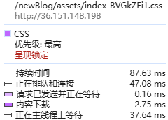

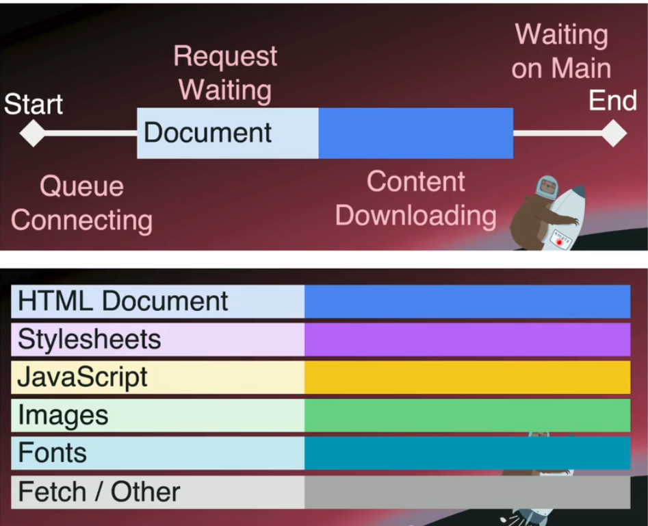

Lighthouse 分数适合做入口，但它只告诉你结果。瀑布图展示的是实际发生了什么：资源何时发现、在哪排队、被什么阻塞。两者要一起看。

## 三、为什么不能只看 DOMContentLoaded 和 load

以前大家会看：

- `DOMContentLoaded`
- `load`

这些时间点仍然有用，但对 SPA 来说，它们不能完整反映用户看到和操作页面的时间。

比如：

- 页面框架加载完了，但核心内容还没出来
- 资源都到了，但页面一直抖动
- 首屏看似完成了，但点按钮仍然卡

因此还要补上内容何时出现、布局是否稳定、交互多久得到反馈这些指标。

## 四、用 Core Web Vitals 对应用户感受

先看三项直接对应用户体验的指标：

- `LCP`：Largest Contentful Paint
- `CLS`：Cumulative Layout Shift
- `INP`：Interaction to Next Paint

再结合下面几项判断请求和首次绘制：

- `TTFB`
- `FCP`
- `FID`

这些指标不是分数清单。每一项都应该对应到一次可复现的加载或交互过程。

## 五、LCP：最大内容绘制

### 1. 衡量主要内容何时出现

LCP 衡量的是：页面主要内容什么时候真正出现在用户眼前。

这比 `DOMContentLoaded` 更贴近“用户觉得页面有用了没有”。

### 2. 哪些元素会被计入 LCP

通常包括：

- 大图
- 背景图
- 大块文本
- 视频封面等主要内容区域

下面这些配图可以配合看：

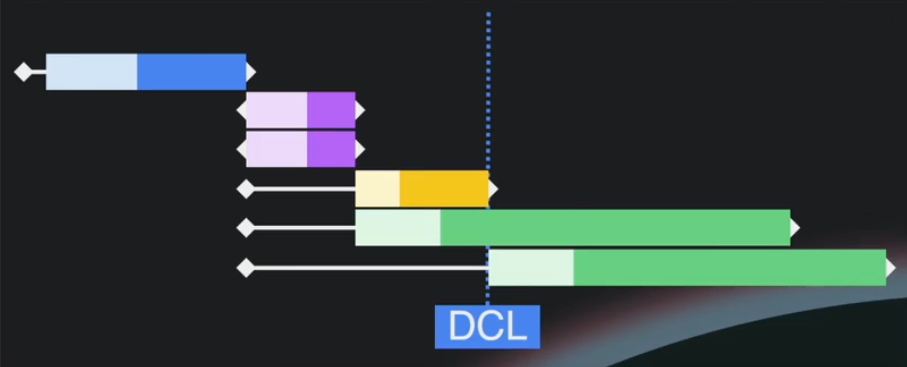

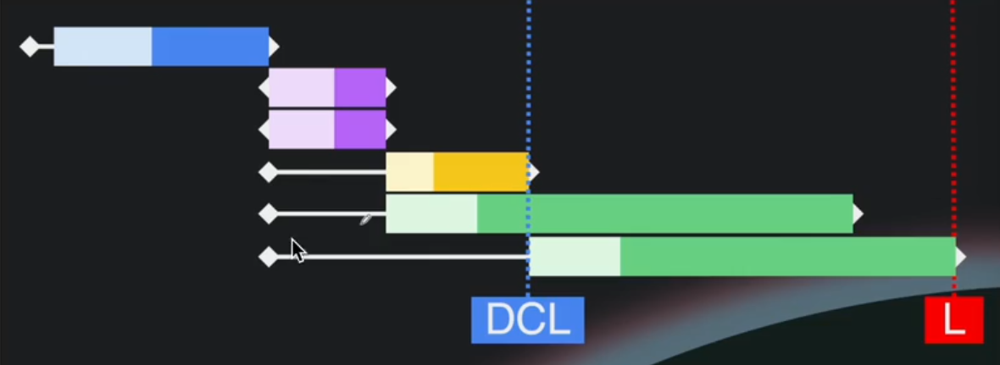

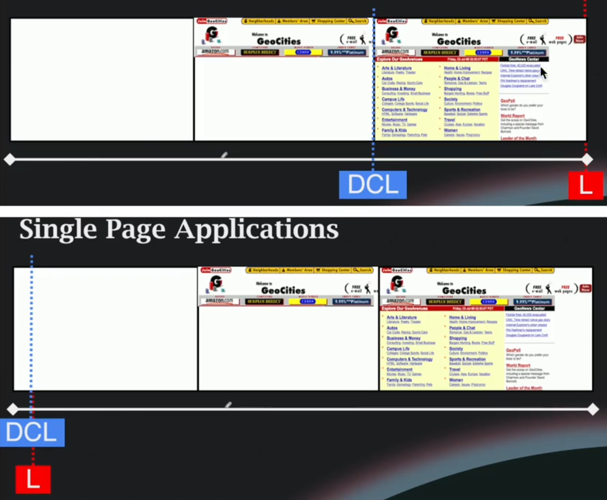

### 3. 评分标准

常见标准是：

- 优秀：`<= 2.5s`
- 需要改进：`2.5s ~ 4s`
- 较差：`> 4s`

### 4. LCP 为什么会差

高频原因包括：

- 服务器首字节慢
- 关键资源发现太晚
- 首屏大图没有预加载
- CSS / JS 阻塞渲染
- 主线程太忙导致内容虽已到达但迟迟不能绘制

## 六、CLS：累计布局偏移

### 1. 衡量页面是否稳定

CLS 衡量的是页面稳定性，也就是页面元素在加载过程中有没有“乱跳”。

### 2. 计算思路

CLS 由受影响的面积和偏移距离共同决定：

`CLS = Impact Fraction × Distance Fraction`

也就是：

- 有多少内容被影响到了
- 这些内容偏移了多远

### 3. 常见成因

- 图片、广告、异步模块没有预留尺寸
- 字体切换引发布局变化
- 在已有内容上方插入新元素
- 动画或脚本直接改布局属性

相关配图如下：

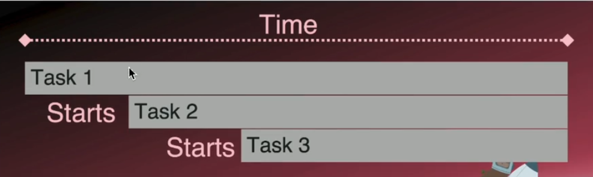

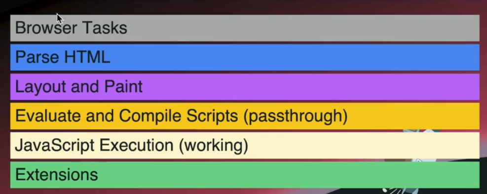

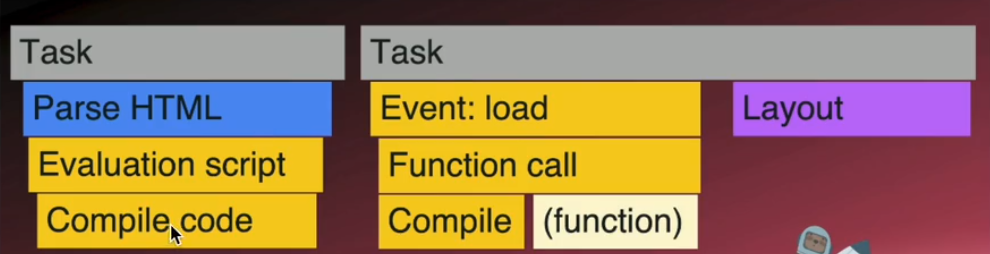

### 4. 评分标准

常见经验值：

- 优秀：`<= 0.1`
- 需要改进：`0.1 ~ 0.25`
- 较差：`> 0.25`

## 七、INP、FCP、TTFB 也不能忽略

### 1. INP

衡量用户交互之后，到下一次可见绘制的延迟。它比旧时代的 FID 更能反映真实交互体验。

### 2. FCP

首次内容绘制，强调“用户第一次看到页面内容”的时间点。

### 3. TTFB

首字节时间，强调从发请求到收到响应第一个字节所花的时间。

这些指标之间并不是替代关系，而是互补关系。

相关图示：

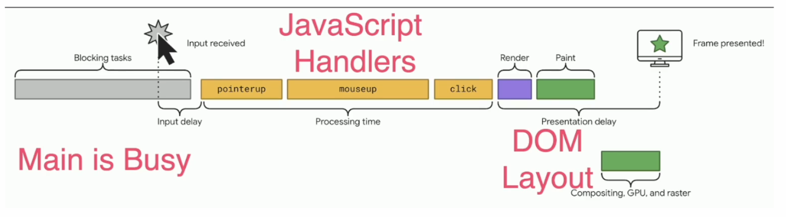

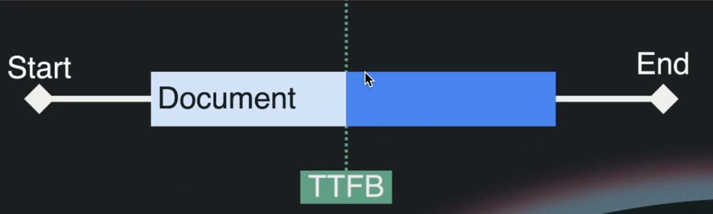

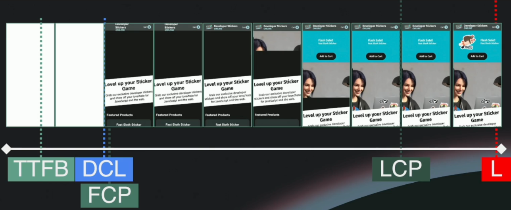

## 八、怎么在浏览器里拿到这些性能数据

页面内的自定义耗时、资源请求和导航记录，可以从 Performance API 开始采集。

## 九、Performance API 基础

### 1. 它是什么

Performance API 是浏览器提供的一组高精度性能接口，允许我们获取：

- 页面加载时间
- 资源加载信息
- 自定义打点耗时
- 与 Web Vitals 相关的性能数据

### 2. `timeOrigin`

这是性能计时的起点，理解它有助于看懂瀑布图、事件时序和 `performance.now()` 的相对时间。

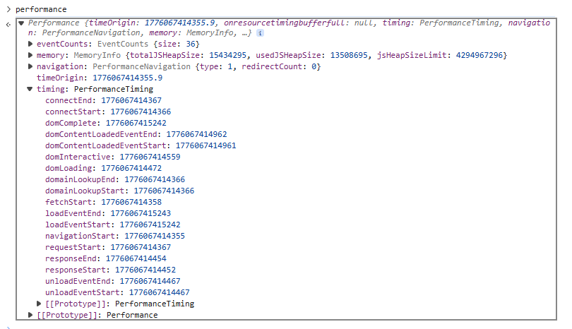

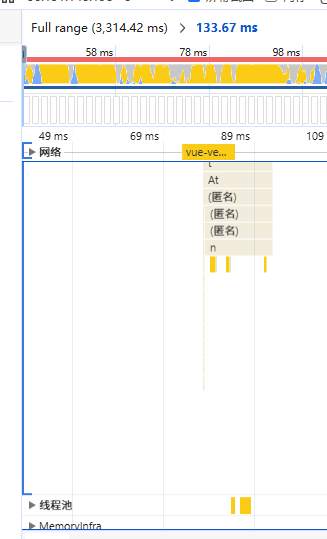

### 3. `performance.now()`

它返回相对 `timeOrigin` 的高精度时间，适合做函数耗时统计。

```js
const start = performance.now();
doSomething();
const end = performance.now();

console.log(`耗时：${end - start}ms`);
```

start 和 end 使用同一个相对时间起点，两者相减就是 doSomething 的执行时间。

### 4. `mark()` 与 `measure()`

这组 API 非常适合做业务打点：

```js
performance.mark("list-start");
renderList();
performance.mark("list-end");
performance.measure("list-render", "list-start", "list-end");
```

两个 mark 确定起止点，measure 生成名为 list-render 的测量记录，后续可以和其他性能条目一起读取。

### 5. `getEntries()` 系列

可以拿到性能条目，例如资源请求、导航记录、测量结果等。

## 十、Performance API 的局限

只靠主动读取 Performance API 有几个限制：

- 某些关键指标不是直接就能从传统接口里稳定拿到
- 有些性能数据如果错过了时机，后面就不好补采
- 单纯轮询 `getEntries()` 不够优雅

需要连续采集时，`PerformanceObserver` 更合适。

## 十一、PerformanceObserver 如何连续采集

### 1. 为什么用观察器

- 观察式获取数据
- 不需要不停主动扫描
- 更适合实时监控
- 可以拿到更多关键性能条目

### 2. 最基本的写法

```js
const observer = new PerformanceObserver((list) => {
  for (const entry of list.getEntries()) {
    console.log(entry.name, entry.startTime, entry.duration);
  }
});

observer.observe({
  type: "largest-contentful-paint",
  buffered: true,
});
```

回调每次收到一批条目，示例逐条输出名称、开始时间和持续时间。这里只订阅了 LCP 类型。

### 3. `buffered: true` 的意义

观察器可能在页面启动后才注册。开启 buffered 后，它会同时读取已经产生的相关条目，减少早期数据遗漏。

相关配图如下：

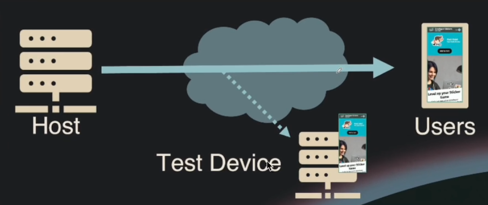

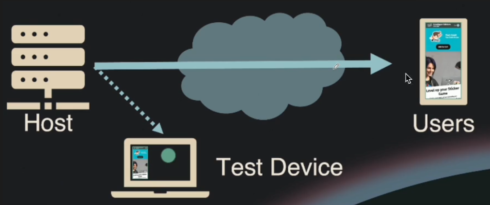

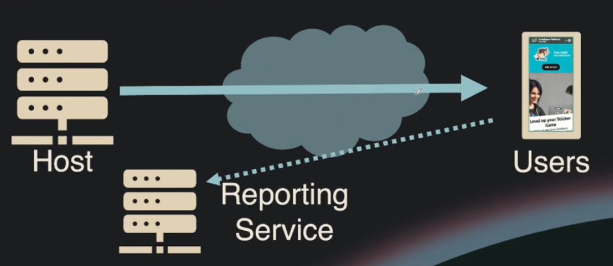

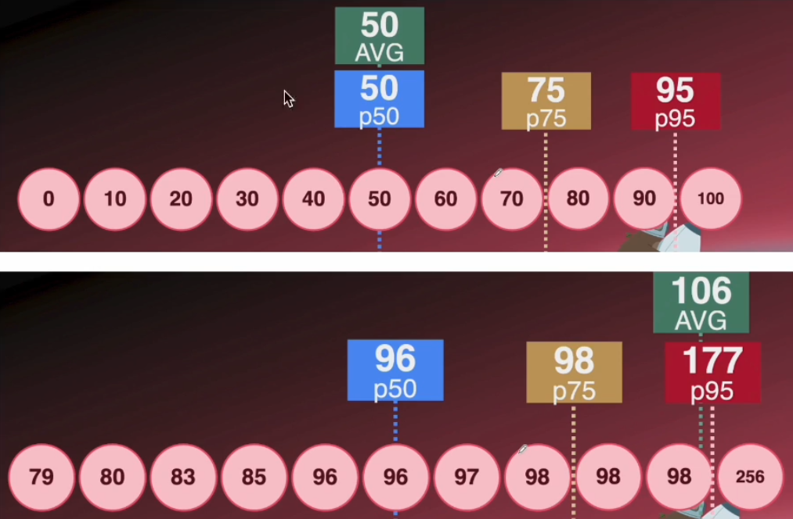

## 十二、性能测试数据要分清 Lab Data 和 Field Data

一次可重复的实验不能代表所有真实用户，而真实用户数据又不适合单独用来复现问题。两类数据要配合使用。

### 1. Lab Data

实验室数据，来自可控环境，例如：

- Lighthouse
- DevTools Performance
- WebPageTest

优点是可重复、可对比，适合排查问题。

### 2. Field Data

真实用户数据，来自真实设备、真实网络、真实地域和真实交互。

典型来源包括：

- CrUX
- RUM 平台
- 自建埋点监控

一般的搭配方式是：

- 用 Lab Data 定位问题
- 用 Field Data 判断真实影响

## 十三、常见性能工具怎么搭配

### 1. Lighthouse

适合快速做整体健康检查，但不要把分数当唯一目标。

### 2. Chrome DevTools Performance

适合看：

- 长任务
- 主线程忙在哪
- Layout / Paint / Script 时间
- FPS 波动

### 3. WebPageTest

更适合网络链路、地域和设备差异对比。

### 4. Web Vitals 扩展、CrUX、RUM

更适合补充真实用户视角。

相关配图：

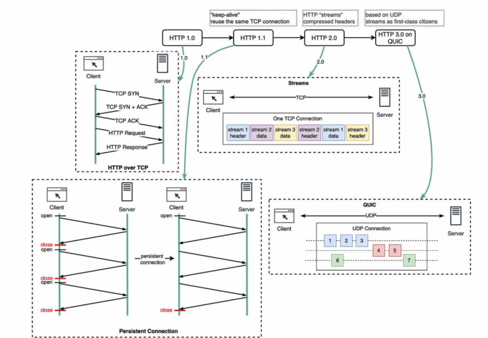

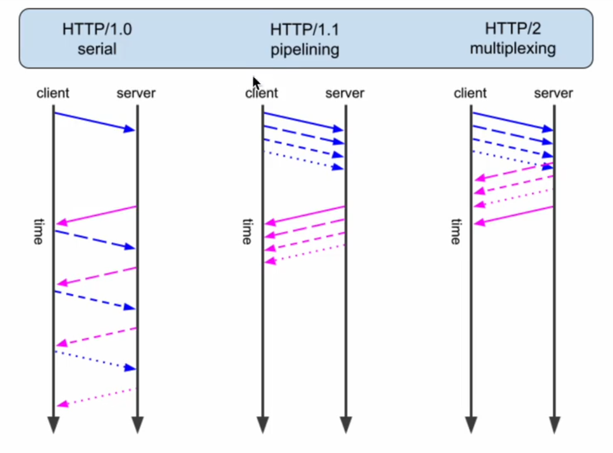

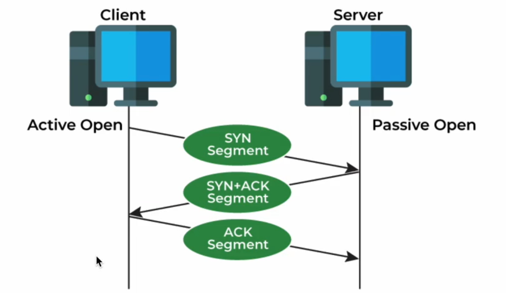

## 十四、性能差了以后，具体怎么优化

优化动作要和异常指标一一对应。否则改了很多配置，也很难证明是哪一项真正生效。

### 1. 优化 TTFB

- 提升服务端响应速度
- 启用 Gzip / Brotli 压缩
- 优化协议和接入层
- 让用户离服务更近，例如 CDN

### 2. 优化 FCP

- 减少关键渲染路径依赖链
- 预加载关键资源
- 避免首屏被大块 JS/CSS 阻塞

### 3. 优化 LCP

- 首屏大图做预加载
- 使用更合适图片格式
- 做缓存和缓存头控制
- 避免主线程被重任务占满

### 4. 优化 CLS

- 给图片、广告、懒加载容器预留尺寸
- 避免在已有内容上方插入异步内容
- 字体加载策略更稳妥

### 5. 优化 INP

- 减少长任务
- 拆分重计算
- 释放主线程
- 降低事件回调内部复杂度

## 十五、虚拟列表只解决一类问题

列表滚动卡顿时，可以按下面的顺序排查：

1. 看 DOM 数量是不是过多
2. 看单个 item 是否过重
3. 看是否频繁触发回流重绘
4. 看主线程是否被 JS、Layout、Paint 占满
5. 做开关对比验证虚拟列表是否真的击中瓶颈

虚拟列表只解决“同时渲染的 DOM 太多”这一类问题。开关前后没有明显变化，就应该继续检查组件渲染、布局计算和主线程长任务。

## 十六、说明性能结果时别漏掉这些信息

### 1. 指标要带上含义和现场

只报缩写和分数没有定位价值。至少要说明它衡量什么、在哪个页面和设备上采集、异常通常由什么造成。

### 2. 观察器启动时间可能漏数据

页面早期已经产生的记录，需要结合 `buffered: true` 读取，不能只观察注册之后的新记录。`PerformanceObserver` 的注册时机也应记入采集方案。

### 3. Lighthouse 分数不是全部

需要结合 Performance 面板、真实用户监控和优化前后对比，才能判断分数变化是否真的改善了用户体验。

### 4. 每条建议都要能回到指标

比如：

- LCP 差就说预加载首屏大图、优化关键链路
- CLS 差就说预留空间
- INP 差就说释放主线程和拆长任务

## 一条可执行的排查顺序

先复现用户感知到的慢，再选对应指标；用 Network 或 Performance 面板定位请求、渲染和主线程瓶颈；最后只改最可疑的一段，并对比修改前后的 Lab Data 与 Field Data。这样才能说明问题在哪里，也能说明这次优化到底有没有用。
