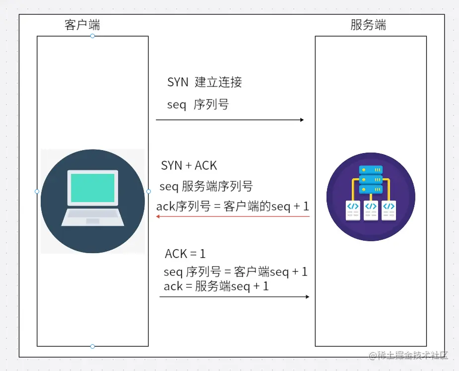
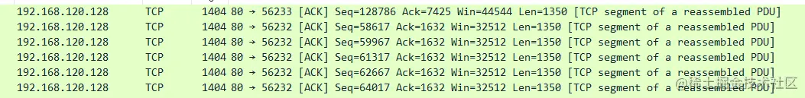
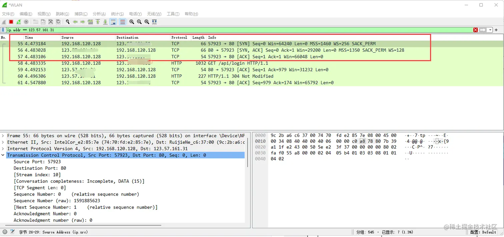
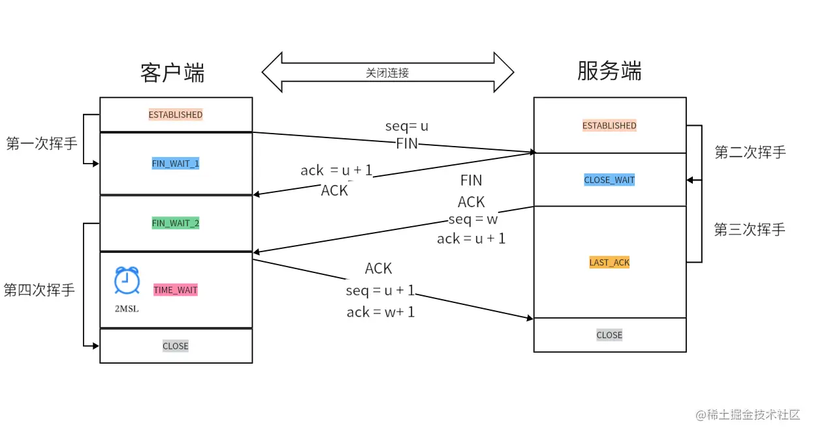

在地址栏输入 URL 后，浏览器要先找到服务器，再建立连接、发送请求并处理响应。缓存会决定是否需要重新下载，同源策略会决定前端能否读取跨站响应，鉴权信息则让服务器识别请求者。

## 一、从浏览器输入 URL 开始，到底发生了什么

整条链路可以分成 URL 解析、DNS 查询、TCP 或 QUIC 建连、HTTP 交互、缓存判断和页面渲染。后面的跨域、SSE 和 JWT，分别对应读取边界、持续推送和身份校验。

## 二、URL 结构先要说清楚

一个 URL 常见组成包括：

- 协议：`http`、`https`
- 域名
- 端口
- 路径
- 查询参数
- hash

协议、域名和端口共同决定请求发往哪里，路径、查询参数和 hash 则定位具体资源或页面状态。

## 三、DNS 域名解析是怎么做的

DNS 解析先尝试复用本地结果，未命中时再向 DNS 服务器查询。

### 1. 本地查找顺序

浏览器通常会先看本地有没有结果，例如：

- 浏览器缓存
- 系统缓存
- hosts 文件

### 2. 远程递归解析

如果本地没有，就会去问本地 DNS 服务器，再逐步查找更高层级的权威服务器，最终拿到目标 IP。

## 四、TCP 三次握手为什么存在

在 HTTP/1.1 和 HTTP/2 语境里，TCP 仍然是建立可靠连接的基础。



建立连接时，两端要确认：

- 能不能发
- 能不能收
- 初始序列号是否同步

### 三次握手的报文顺序

1. 客户端发 `SYN`，想建立连接
2. 服务端回 `SYN + ACK`
3. 客户端再回 `ACK`

分析抓包时会看到下面这些字段：

- `seq`
- `ack`
- `SYN`
- `ACK`
- `FIN`

其中 seq 和 ack 跟踪字节序号与确认位置，SYN 用于建立连接，FIN 用于结束发送方向。



## 五、TCP 四次挥手为什么比三次握手多一次

断开连接时，双方的数据发送和接收关闭通常不是同一时刻完成，所以需要更细地拆成四步。



可以简化理解为：

1. 我不发了
2. 我知道你不发了
3. 我这边也发完了
4. 我知道你这边也发完了



## 六、HTTP 请求如何选方法和请求头

### 1. 请求方法

常见方法包括：

- `GET`
- `POST`
- `PUT`
- `PATCH`
- `DELETE`
- `OPTIONS`

### 2. `OPTIONS` 预检什么时候触发

当请求不是“简单请求”时，浏览器会先发 `OPTIONS` 预检请求，确认服务器是否允许跨域、允许哪些方法、是否允许自定义头等。

常见触发条件包括：

- 使用了非常规方法
- 带了自定义请求头
- `Content-Type` 不属于简单请求范围

## 七、浏览器缓存机制一定要和状态码一起记

### 1. 强缓存

强缓存命中时，浏览器直接使用本地副本，不向服务器发请求。

常见控制字段：

- `Cache-Control: max-age=...`
- `Expires`

命中时你通常会在 DevTools 里看到：

- `from memory cache`
- `from disk cache`

### 2. 协商缓存

当强缓存过期后，请求才会继续走协商缓存。

两组常见头信息：

- `Last-Modified` / `If-Modified-Since`
- `ETag` / `If-None-Match`

其中 `ETag` 往往精度更高。

### 3. 完整流程

1. 先查强缓存
2. 强缓存失效后，发请求走协商缓存
3. 资源未变返回 `304`
4. 资源已变返回 `200 + 新内容`

## 八、HTTP 状态码怎么分组记忆

HTTP 状态码按类别表达请求处理到了哪一步，排查时先看首位数字。

### 1xx：信息类

- `100 Continue`
- `101 Switching Protocols`

### 2xx：成功类

- `200 OK`
- `201 Created`
- `202 Accepted`
- `204 No Content`
- `206 Partial Content`

### 3xx：重定向类

- `301 Moved Permanently`
- `302 Found`
- `304 Not Modified`
- `307 Temporary Redirect`
- `308 Permanent Redirect`

重定向和缓存中要特别区分：

- `301` 和 `302` 的区别
- `307` / `308` 为什么强调保留请求方法
- `304` 为什么是缓存优化中的关键状态码

### 4xx：客户端错误

常见如 `400`、`401`、`403`、`404`。

### 5xx：服务端错误

常见如 `500`、`502`、`503`、`504`。

## 九、跨域为什么会发生，怎么解决

### 1. 什么是跨域

协议、域名、端口任意一个不同，就不是同源。

### 2. 为什么会有跨域限制

因为浏览器同源策略要保护用户安全，防止页面随意读取其他站点敏感资源。

### 3. 常见解决方案

#### JSONP

JSONP 只支持 `GET`，它依赖 `script` 标签可以跨域加载资源的特性，新项目通常不再使用。

#### 开发环境代理

Vite 和 Webpack Dev Server 都可以让前端请求先到本地代理，再由代理访问目标服务。

#### CORS

后端通过 CORS 响应头声明允许的源、方法和请求头，浏览器校验通过后才把响应交给页面。

#### Nginx 反向代理

Nginx 可以把多个后端服务挂到同一域名入口下，前端只请求这个统一入口。

CORS 放行和缓存命中是两层机制。即使服务器返回 `304`，跨域页面能否读取响应仍由 CORS 响应头决定。

## 十、SSE 和 WebSocket 到底怎么区分

实时数据不一定需要双向通信。日志流、通知和 AI 流式输出只需要服务器持续向页面发消息，SSE 正好对应这种模型。

### 1. SSE 是什么

SSE（Server-Sent Events）是服务器向客户端单向持续推送消息的能力。

### 2. 前端 API

创建 EventSource 后，浏览器会保持连接，服务器发来的默认消息会进入 onmessage 回调：

```js
const source = new EventSource("/sse");

source.onmessage = (event) => {
  console.log(event.data);
};
```

消息内容放在 event.data 中。连接断开后，EventSource 还会按协议行为尝试重连。

### 3. 服务端必须返回哪些头

典型响应头包括：

```http
Content-Type: text/event-stream
Cache-Control: no-cache
Connection: keep-alive
```

Content-Type 声明这是事件流，禁用缓存可避免中间层囤积消息，keep-alive 用来保持长连接。

### 4. SSE 和 WebSocket 的差异

- SSE：服务端到客户端单向推送
- WebSocket：双向实时通信
- SSE 基于 HTTP，更轻
- WebSocket 更适合强交互场景

如果是 AI 打字机、日志流、通知流，SSE 很合适；如果要聊天室、协同编辑、游戏对战，往往更偏向 WebSocket。

## 十一、HTTP 版本在解决什么

### 1. HTTP/1.0

连接复用能力弱，很多请求开销大。

### 2. HTTP/1.1

支持长连接，仍然是最广泛使用的版本之一。

### 3. HTTP/2

它用二进制分帧组织消息，通过多路复用减少并发请求的连接成本，并用头部压缩减少重复字段。

### 4. HTTP/3

基于 QUIC，不再依赖 TCP，重点是进一步优化弱网、丢包和连接建立成本。

### 5. HTTPS

本质是 HTTP + TLS。

它通过加密、完整性校验和证书验证，分别处理窃听、篡改和冒充问题。

## 十二、JWT 鉴权怎么理解

JWT 把声明和签名放进 token，服务器验证签名后就能确认内容是否被篡改。

### 1. JWT 结构

JWT 由三部分组成：

- Header
- Payload
- Signature

### 2. 它的优点

- 无状态，服务端不一定要存会话
- 前后端分离项目很常见
- 移动端和多端接入都比较自然

### 3. 它的缺点

- 一旦签发，天然不容易主动失效
- 如果放在不安全位置，存在泄漏风险
- Payload 只是 Base64URL 编码，不是加密

### 4. 前端常见使用流程

1. 用户登录成功后拿到 token
2. 前端保存 token
3. 后续请求在请求头里带上
4. 服务端校验合法性和有效期

实际使用时还要明确 token 存放位置、过期处理、刷新策略，以及 XSS 和 CSRF 防护，不能只停在签发和校验两步。
